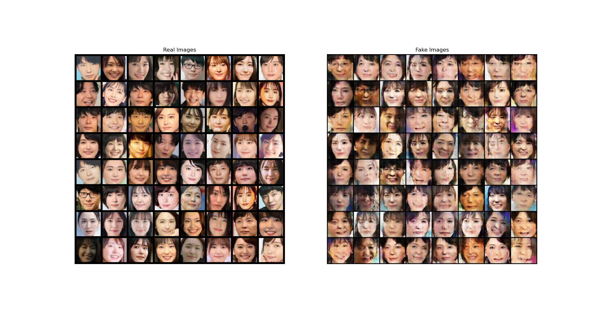

# HOSHINOGAN
星野源とガッキーの顔を元にDCGANを用いて顔画像を生成します。
image_hoshinofamilyディレクトリ内にある画像を使用して学習を行います。
星野源のみ、ガッキーのみの画像はそれぞれOnlyGEN image,OnlyGAKKI imageに収めてあるので適宜学習に使用したい画像のディレクトリをimage_hoshinofamilyに収めてください。
初期段階ではCPUで学習を行うようにセッティングしているので、GPUを使用する際は、"ngpu = 1"に変更してください。
このソースコードはhttps://pytorch.org/tutorials/beginner/dcgan_faces_tutorial.html を参考に作成しています。

Generate facial images using DCGAN based on the faces of Gen Hoshino and Gakki.  
Images in the image_hoshinofamily directory are used for training.  
The images of only Gen Hoshino and only Gakki are stored in the OnlyGEN image and OnlyGAKKI image directories, respectively, so please put the images you wish to use for training in the image_hoshinofamily directory as appropriate.  
In the initial stage, training is set to be performed on the CPU, so please change to "ngpu = 1" when using the GPU.  
This source code is based on https://pytorch.org/tutorials/beginner/dcgan_faces_tutorial.html.  

# Sample Result
"eval"ファイルに異なるハイパーパラメータでの学習結果のサンプルを格納しています。  
↓実行結果例  

# GUIによる顔特徴調整
TBA...
